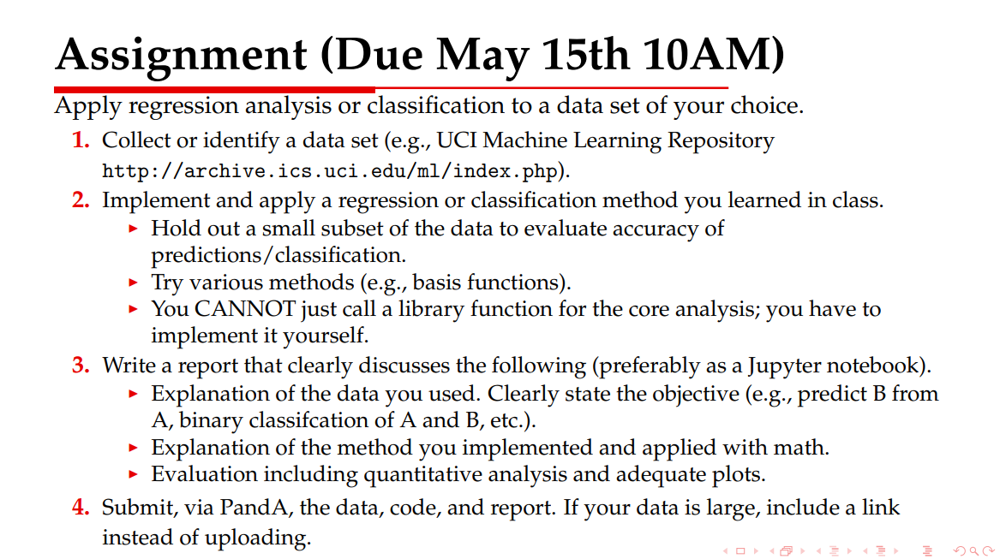

Gaussian Bayes Classifier

# 1st Assignment Report for Pattern Recognition
Name:  陳　鵬　(Chen Peng) <br>
Lab:   Yoshikawa & Ma Laboratory <br>
StuID: 6930-30-2948 <br>
Email: chenpeng.acmer@yahoo.com

----------------------------------------------------------------------------------------------------------------
# 1. Introduction

## (1) Data Explanation
### The data set "Wine", downloaded from UCI Irvine Machine Learning Repository, is being used in the following analysis. Data in "Wine" are the results of a chemical analysis of wines grown in the same region in Italy but derived from three different cultivars which actually form the categories we want to classify in the task.

### The attribute set consists of the quantities of 13 constituents found in each of the three types of wines:
1) Alcohol <br>
2) Malic acid <br>
3) Ash <br>
4) Alcalinity of ash <br>
5) Magnesium <br>
6) Total phenols <br>
7) Flavanoids <br>
8) Nonflavanoid phenols <br>
9) Proanthocyanins <br>
10) Color intensity <br>
11) Hue <br>
12) OD280/OD315 of diluted wines <br>
13) Proline <br>

### There are three classes (cultivars). Class distribution: (number of instances per class)
class 1: 59 <br>
class 2: 71 <br>
class 3: 48 <br>
Total: 178 instances

###  All attributes are continuous. No missing attribute values.
### An example follows:
class=2, Alcohol=12.67, Malic acid=0.98, Ash=2.24, Alcalinity of ash=18, Magnesium=99, Total phenols=2.2, Flavanoids=1.94, Nonflavanoid phenols=0.3, Proanthocyanins=1.46, Color intensity=2.62, Hue=1.23, OD280/OD315 of diluted wines=3.16, Proline=450

## (2) Objective: ternary classifiction
### Given an instance in "Wine" with 13 attributes, classifiy it as one of three types of wines.

-------------------------------------------------------------------------------------------------------------------------------------
# 2. Method

## Probabilistic Generative Models: Gaussian Bayes Classifier
## (1) Analysis
### From the example above, we find that all attributes, such as "Alcohol", "Proline" and "Malic acid" are continuous, not discrete. There is an assumption that data from each class is drawn from a simple Gaussian distribution.
#### Here is the distribution of ith attribute of instances of class K.
$$ p(x_{i}|C_{k}) = \frac{1}{(2\pi)^{D/2}|\Sigma|_{k,i}^{1/2}   } exp\{ -\frac{1}{2}(x_{i}-\mu_{k, i})^{T}\Sigma_{k,i}^{-1}(x_{i}-\mu_{k,i})\} = \mathcal{N}(x_{i}|\mu_{k,i}, \Sigma_{k,i})
 $$

#### $$ x_{i}:\text{the ith attribute of x},\ \ \mu_{k,i}: mean,\ \ \Sigma_{k,i}: \text{covariance matrix of ith attribute in class k}, \ \ D: dim(x_{i}) $$

### Here, we introduce another assumption, named attribute conditional independence assumption, which is adopted in Naive Bayes Classifier. Then, we have:
$$ p(x|C_{k}) = \prod_{i=1}^{d}p(x_{i}|C_{k}) = \prod_{i=1}^{d}\mathcal{N} (x_{i}| \mu_{k,i}, \Sigma_{k,i} ), \ \ d: number \ of \ attributes, \ here, \ d = 13 $$

### In this case of three classes, the posterior probability for class k can be written as:
$$ p(C_{k}|x) = \frac{p(x|C_{k})p(C_{k})}{p(x)}=\frac{p(x|C_{k})p(C_{k})}{\sum_{j}p(x|C_{j})p(C_{j})} = \frac{exp(a_k)}{\sum_{j}exp(a_{j})} $$
### where
$$ a_{k} = ln(p(x|C_{k})p(C_{k})) $$

### Here we know how to calculate the posterior probability as long as we get parameters of all distributions.

## (2) Maximum likelihood solution: Parameter Estimation
### Here, we have a data set  {xn, Cn}  where  n = 1,2,3 ... N, where Cn = 1 denotes class 1, Cn = 2 denotes class 2 and Cn = 3 for class 3.
### We have $$ p(x_{n}, C_{k}) = p(C_{k})p(x_{n}|C_{k}) = p(C_{k}) \prod_{i=1}^{d}\mathcal{N} (x_{n,i}| \mu_{k,i}, \Sigma_{k,i} ) $$
### Therefore, the likelihood is given by
$$ p(x, C) = \prod_{n=1}^{N}p(x_{n}, C_{n}) = \prod_{n=1}^{N}\prod_{i=1}^{d}p(C_{n}) \mathcal{N}(x_{n,i}| \mu_{k,i}, \Sigma_{k,i}) $$
### To maximize the likelihood, we need to calculate derivatives with respect to each parameter. Here the derivation process is omitted. Then we obtain
$$ p(C_{k}) = \frac{N_{k}}{N} $$
$$ \mu_{k,i} = \frac{1}{N_{k}} \sum_{class = k} x_{n,i} $$
$$  \Sigma_{k,i} = \frac{1}{N_{k}} \sum_{n\in C_{k}}(x_{n,i} - \mu_{n,i})^{T}(x_{n,i} - \mu_{n,i}) $$

### It is worth mentioning that if we the share covariance matrix among all attributes and classes, the shared matrix could be a weighted average of all covariance matrices $ \Sigma_{k,i} $


### Until here, we have got all parameters for all Gaussian distributions. Then, given an instance in the test set, the posterior probabilities $ p(C_{k}|x) $ could be calculated by using softmax function, and the result becomes
$$ class \ of \ x = argmax_{k \in C}\ p(C_{k}|x) $$

-------------------------------------------------------------------------------------------------------------------------------------
# 3. Experiment

### (1) Split data set
### In the experiment, the data set is randomly divided into two parts: the training set A and the test set B.
### Total size: 178, Size of A: 142, Size of B: 36.  Ratio: 8 : 2


```python
import csv
import math
import random

with open('wine.data', 'r') as file:
    wine = [line for line in csv.reader(file)]
print('The total size of the data set: {}'.format(len(wine)))

training_size = int(0.8 * len(wine))
training_set = []
test_size = len(wine) - training_size
test_set = []

training_count = 0
copy_wine = wine.copy()
while(training_count < training_size):
    idx = random.randint(0, len(copy_wine)-1)
    training_set.append(copy_wine[idx])
    copy_wine.pop(idx)
    training_count += 1
test_set = copy_wine.copy()

print('Size of trianing set: {}. Size of test set: {}.'.format(len(training_set), len(test_set)))
```

    The total size of the data set: 178
    Size of trianing set: 142. Size of test set: 36.


### (2) Parameter Estimation: calculate $ \mu_{k,i} $ and $ \Sigma_{k,i} $ where k = 1,2,3 and i = 1,2, ... , size of set


```python
def getMu(data_set):
    mu = [[0 for i in range(13)] for j in range(3)] # size: 3 * 13
    count = [0 for i in range(3)] # size: 3, count the number of classes
    for item in data_set: # iterate all instances in this set
        class_id = int(item[0])
        count[class_id - 1] += 1
        for j in range(1, 14):
            mu[class_id - 1][j - 1] += float(item[j])
    for i in range(3):
        for j in range(13):
            mu[i][j] /= float(count[i])
    return mu

def getSigma(data_set, mu):
    Sigma = [[0 for i in range(13)] for j in range(3)] # size: 3 * 13
    count = [0 for i in range(3)] # size: 3, count the number of classes
    for item in data_set:
        class_id = int(item[0])
        count[class_id - 1] += 1
        for j in range(1, 14):
            Sigma[class_id - 1][j - 1] += (float(item[j]) - mu[class_id - 1][j - 1]) ** 2
    for i in range(3):
        for j in range(13):
            Sigma[i][j] /= float(count[i])
    return Sigma

def getPCk(data_set):
    count = [0 for i in range(3)]
    for item in data_set:
        class_id = int(item[0])
        count[class_id - 1] += 1
    return count

training_mu = getMu(training_set)
training_Sigma = getSigma(training_set, training_mu)
pCk = getPCk(training_set)
```

### (3) Evaluation: given an instance in test set, calculate $  a_{k}$ for each class, then use softmax function.


```python
def Gaussian(x, mu, Sigma):
    numerator = math.exp(-0.5 * (x - mu) ** 2 / Sigma)
    denominator = math.sqrt(2 * math.pi * Sigma)
    return numerator / denominator

def getA(x, k, pCk, mu, Sigma):
    a = math.log(pCk)
    for i in range(13):
        a += math.log(Gaussian(float(x[i]), mu[i], Sigma[i]))
    return a

def softmax(a):
    res = []
    sum_exp_a = 0.0
    for i in range(3):
        sum_exp_a += math.exp(a[i])
    for i in range(3):
        res.append(math.exp(a[i]) / sum_exp_a)
    return res

classification = []

for idx in range(len(test_set)):
    item = test_set[idx]
    a = []
    for i in range(3): # calculate ak of 3 classes
        a.append(getA(item[1:], i, pCk[i], training_mu[i], training_Sigma[i]))
    P = softmax(a)

    pMax = 0.0
    ans_class = -1
    for i in range(3):
        if P[i] > pMax:
            pMax = P[i]
            ans_class = i + 1
    classification.append(ans_class)

correct = 0

for idx in range(len(test_set)):
    item = test_set[idx]
    print("{}: Ground Truth: {}, Classification: {}".format(idx, int(item[0]), classification[idx]), end=", ")
    if int(item[0]) == classification[idx]:
        correct += 1
        print('Correct')
    else:
        print('Incorrect')

print("Accuracy: {}".format(float(correct) / len(test_set)))
```

    0: Ground Truth: 1, Classification: 1, Correct
    1: Ground Truth: 1, Classification: 1, Correct
    2: Ground Truth: 1, Classification: 1, Correct
    3: Ground Truth: 1, Classification: 1, Correct
    4: Ground Truth: 1, Classification: 1, Correct
    5: Ground Truth: 1, Classification: 1, Correct
    6: Ground Truth: 1, Classification: 1, Correct
    7: Ground Truth: 1, Classification: 1, Correct
    8: Ground Truth: 1, Classification: 2, Incorrect
    9: Ground Truth: 1, Classification: 1, Correct
    10: Ground Truth: 1, Classification: 1, Correct
    11: Ground Truth: 1, Classification: 1, Correct
    12: Ground Truth: 1, Classification: 1, Correct
    13: Ground Truth: 1, Classification: 1, Correct
    14: Ground Truth: 1, Classification: 1, Correct
    15: Ground Truth: 1, Classification: 1, Correct
    16: Ground Truth: 2, Classification: 2, Correct
    17: Ground Truth: 2, Classification: 2, Correct
    18: Ground Truth: 2, Classification: 2, Correct
    19: Ground Truth: 2, Classification: 2, Correct
    20: Ground Truth: 2, Classification: 2, Correct
    21: Ground Truth: 2, Classification: 2, Correct
    22: Ground Truth: 2, Classification: 2, Correct
    23: Ground Truth: 2, Classification: 2, Correct
    24: Ground Truth: 2, Classification: 2, Correct
    25: Ground Truth: 2, Classification: 2, Correct
    26: Ground Truth: 2, Classification: 2, Correct
    27: Ground Truth: 3, Classification: 3, Correct
    28: Ground Truth: 3, Classification: 3, Correct
    29: Ground Truth: 3, Classification: 3, Correct
    30: Ground Truth: 3, Classification: 3, Correct
    31: Ground Truth: 3, Classification: 3, Correct
    32: Ground Truth: 3, Classification: 3, Correct
    33: Ground Truth: 3, Classification: 3, Correct
    34: Ground Truth: 3, Classification: 3, Correct
    35: Ground Truth: 3, Classification: 3, Correct
    Accuracy: 0.9722222222222222


### At last, the accuracy is 97.2%
